# Yihen-Drama（AI 短剧生成平台）

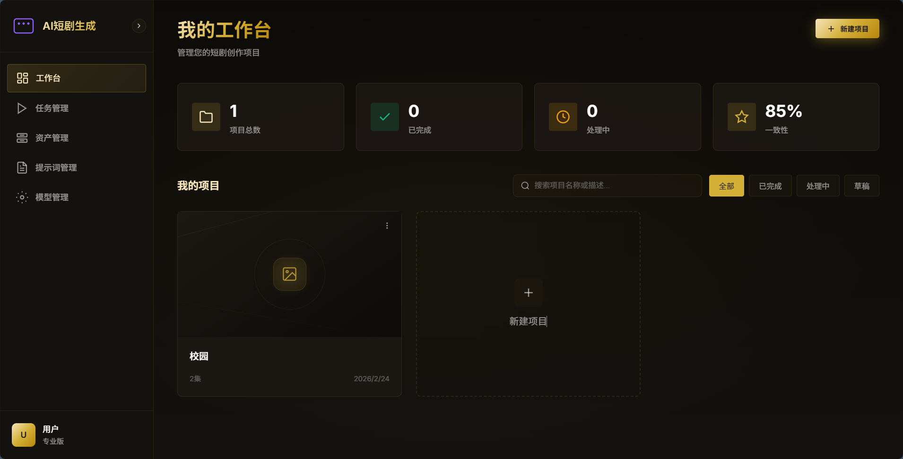

一个覆盖「文本输入 → 信息提取 → 人物/场景图生成 → 分镜生成 → 视频生成/编辑」的全流程短剧创作系统。

仓库包含：
- 后端：`yihen-drama`（Spring Boot）
- 前端：`yihen-ai-short-drama-front-end/frontend`（Vue 3 + Vite）
- 容器编排：支持**开发模式**与**一键全容器模式**

---

## 0. 准备工作

​	在使用该系统前，请配置好对应模型的API-KEY

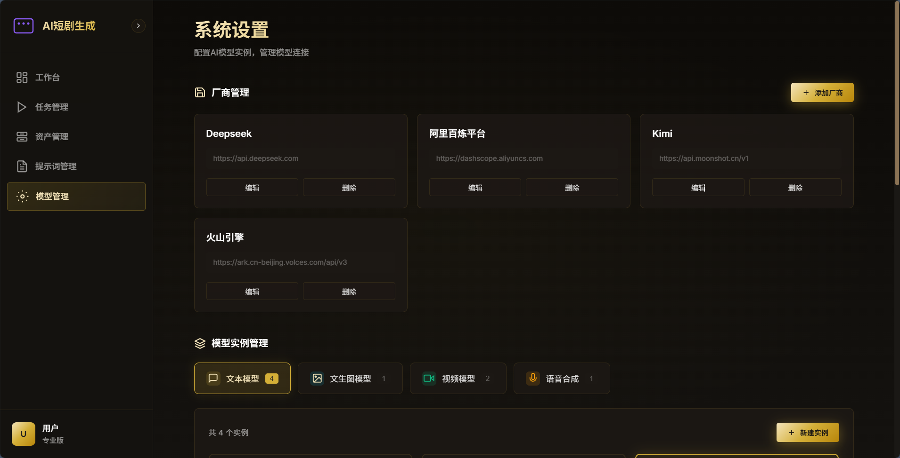

​	在模型管理中，配置了默认的模型厂商。如需要接入其他模型，可以自定义添加厂商填写对应信息。

​	以火山引擎为例，点击模型卡片，为默认模型填写API-KEY，也可以自己根据文档添加模型。（文本模型，图像模型，视频模型都需要配置）

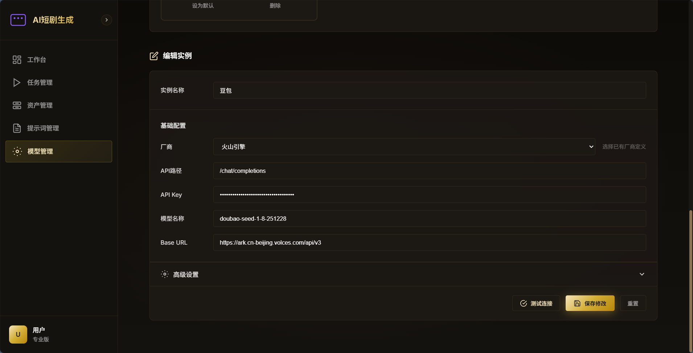

## 1. 功能概览

- 项目/章节管理：创建、编辑、删除、搜索、分页

### 1.1 项目/章节管理

​	每个项目为一部漫剧内容，每一个项目下可以创建多个章节，创建时请选中动漫风格（暂时只适配该风格）

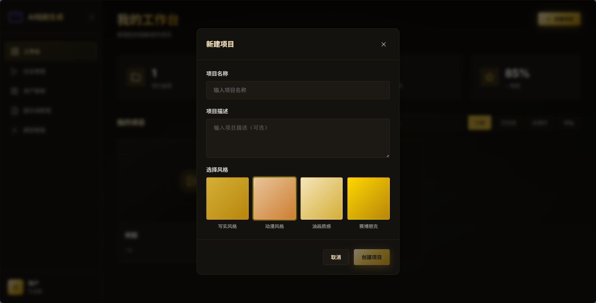

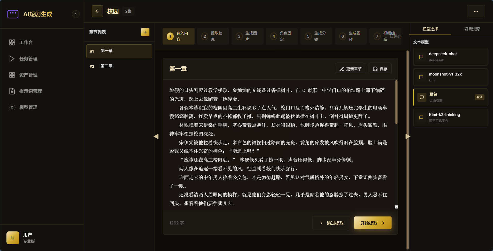

>  支持的功能：


### 1.2 信息提取

​	点击开始提取后，等待提取结果。如果出现问题可检查是否开启代理。提取信息的文本模型默认为 模型管理 中的默认模型，也可以手动选择（需要提前配置）

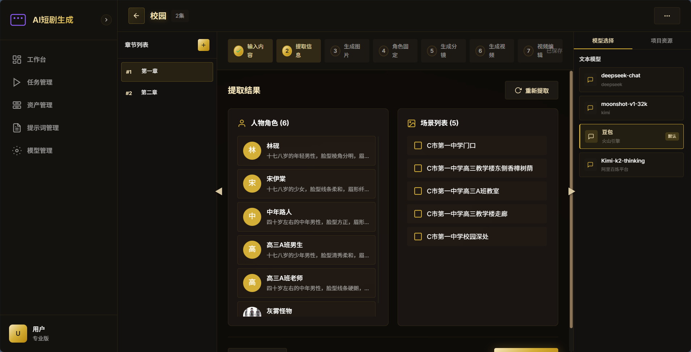

> 支持的功能


### 1.3 资产管理

​	对提取的角色，场景进行图片生成。生成图片不符合可修改描述重新生成 或 自己上传图片。对于不需要的人物或场景也可以自行删除。

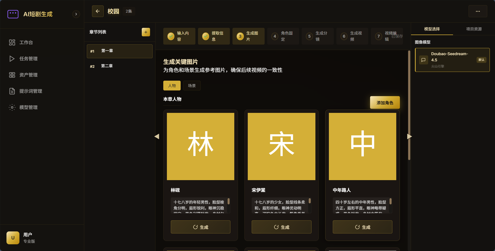

​	对于生成的角色，场景。可以统一在左侧侧边栏中的资产管理中进行统一管理。

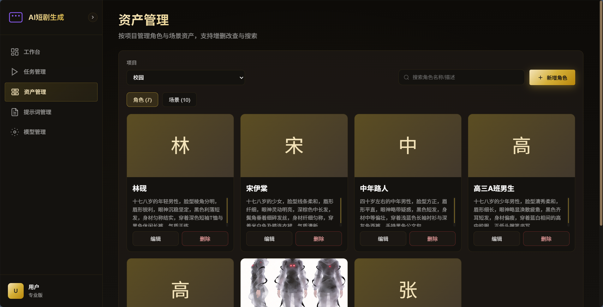

> 支持的功能


### 1.5 角色固定

​	该功能为适配Sora模型，暂时不使用，可以直接进入下一步生成分镜。

### 1.6 分镜管理

​	为上传的章节内容画风分镜，每一个分镜关联一个场景（必需）和 角色（不超过3个），若划分分镜不满意可以自行修改、删除或添加。

​	关联的角色和场景可以点击更换

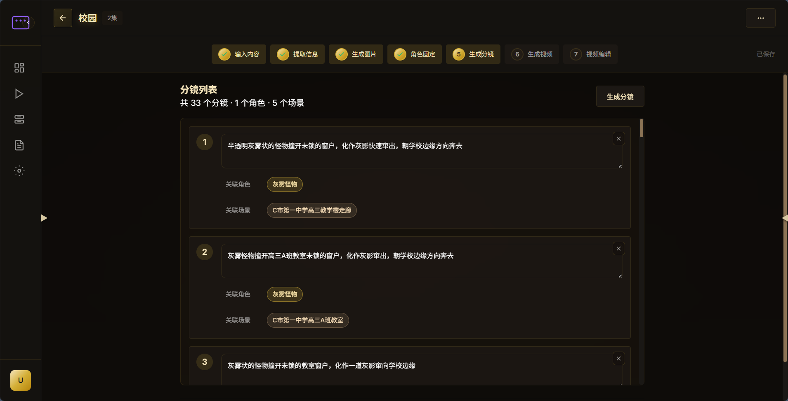

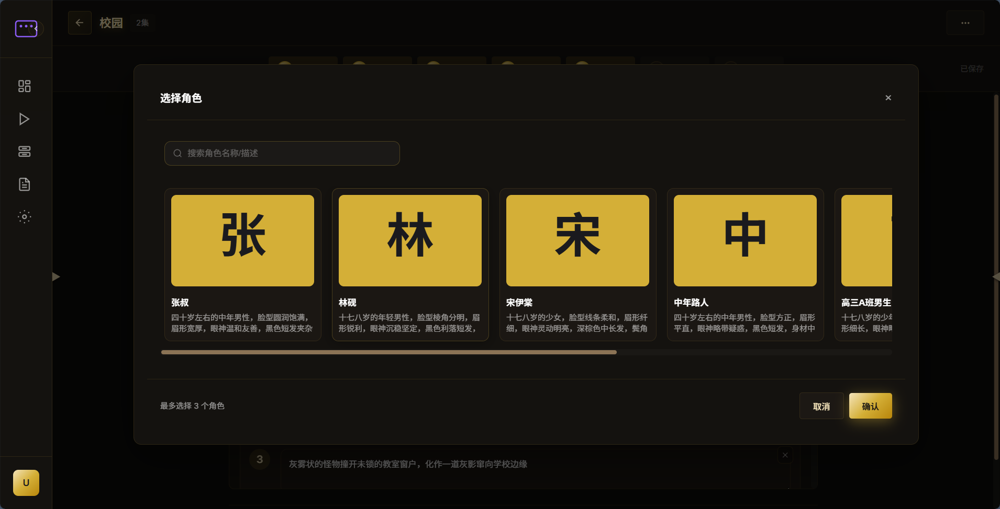

> 支持的功能


### 1.7 视频生成

​	为每个分镜生成对应的视频。首先点击生成提示词，根据关联的场景和角色生成首帧提示词。待提示词生成完毕后可生成首帧，接着生成视频

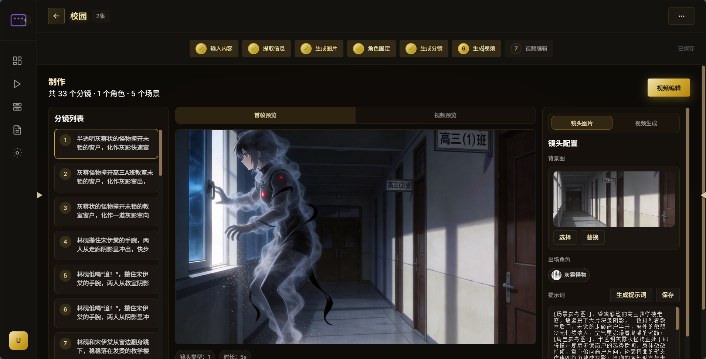

> 支持的功能


### 1.8 模型管理

​	除提供默认的几个模型外，可以根据需要自行添加模型。

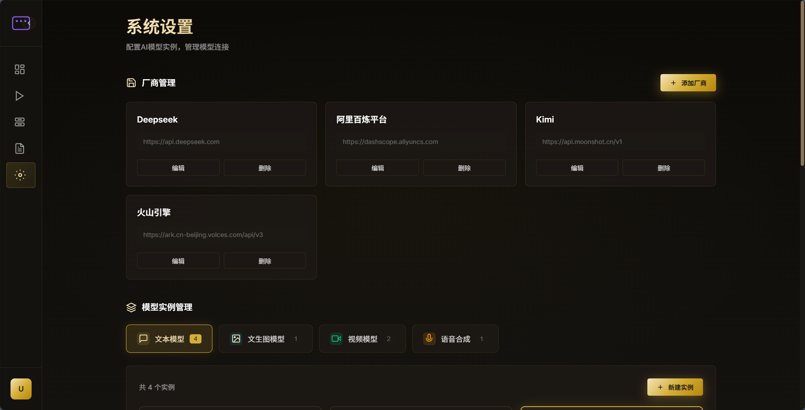

> 支持的功能

​	

### 1.9 提示词管理

​	每个步骤都有对应的提示词，可以创建新的提示词，但请注意保留好占位符（具体见默认提示词写法），使用新提示词需要将其设置为默认才能生效

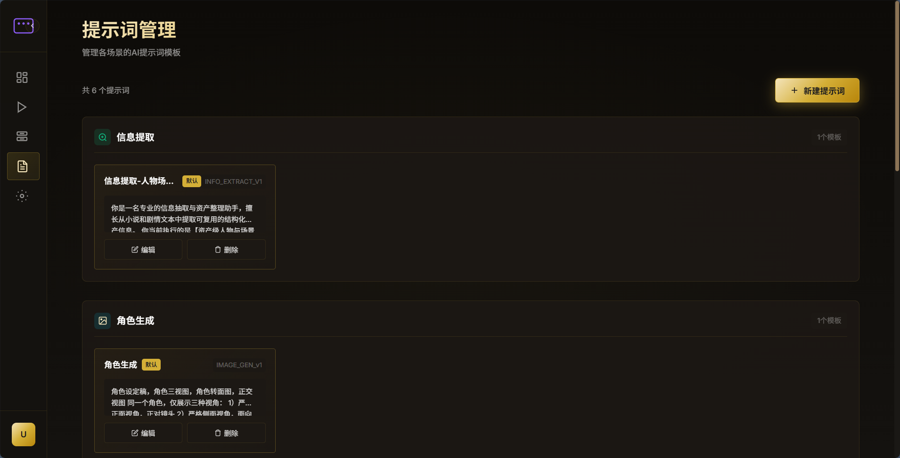

> 支持的功能


---

## 2. 运行模式（重点）

### A. 本地开发模式（推荐日常开发）

前后端本机运行；MySQL/Redis/RabbitMQ/MinIO/ES/Kibana 用容器。

#### 1) 启动中间件
```powershell
.\infra-up.ps1
```
或
```bat
infra-up.bat
```
等价命令：
```bash
docker compose -f docker-compose.infra.yml up -d --build
```

#### 2) 启动后端（本机）
```bash
cd yihen-drama
mvn spring-boot:run
```
默认端口：`8080`

#### 3) 启动前端（本机）
```bash
cd yihen-ai-short-drama-front-end/frontend
npm install
npm run dev
```
默认端口：`3000`

说明：
- 前端开发代理已配置：`/api` 与 `/webSocket` 自动转发到 `localhost:8080`
- 不需要在前端手工改成 `8080`

---

### B. 一键全容器模式（部署/演示）

```powershell
.\deploy.ps1
```
或
```bat
deploy.bat
```
等价命令：
```bash
docker compose -f docker-compose.full.yml up -d --build
```

---

## 3. 访问地址

- 前端：`http://localhost:3000`
- 后端：`http://localhost:8080`
- API 文档：`http://localhost:8080/doc.html`
- MinIO Console：`http://localhost:9001`
- RabbitMQ Console：`http://localhost:15672`
- Elasticsearch：`http://localhost:9200`
- Kibana：`http://localhost:5601`

---

## 4. 数据库初始化

- 初始化脚本：`yihen-drama/sql/init_schema.sql`
- 在 MySQL 数据卷为空时自动执行
- 如需重置初始化：
```bash
docker compose -f docker-compose.full.yml down -v
docker compose -f docker-compose.full.yml up -d --build
```

---

## 5. Elasticsearch 插件（IK + pinyin）

已内置在 `yihen-drama/docker/elasticsearch/Dockerfile`，随编排自动安装。

可验证：
```bash
docker compose -f docker-compose.full.yml exec es elasticsearch-plugin list
```

---

## 6. 关键配置说明

后端配置文件：`yihen-drama/src/main/resources/application.yml`

已改为环境变量优先，兼容两种运行模式。核心变量：
- `SPRING_DATASOURCE_URL/USERNAME/PASSWORD`
- `SPRING_DATA_REDIS_HOST/PORT/PASSWORD`
- `SPRING_RABBITMQ_HOST/PORT/USERNAME/PASSWORD`
- `SPRING_ELASTICSEARCH_URIS`
- `MINIO_END_POINT/MINIO_ACCESS_KEY/MINIO_SECRET_KEY`

---

## 7. 项目结构

```text
.
├─ docker-compose.infra.yml     # 仅中间件
├─ docker-compose.full.yml      # 前后端 + 中间件
├─ infra-up.ps1 / infra-up.bat
├─ deploy.ps1 / deploy.bat
├─ yihen-drama                  # 后端
└─ yihen-ai-short-drama-front-end/frontend  # 前端
```

---

## 8. 常见问题

### Q1: 后端报 Redis 连接失败
- 检查 `docker compose -f docker-compose.infra.yml ps`
- 确保 `redis` 已启动并健康

### Q2: 前端请求打到了 3000 而不是 8080
- 本地开发这是正常行为（Vite 代理）
- 真正后端仍是 `8080`

### Q3: DockerHub 拉取超时
- 可替换镜像源，或提前 `docker pull` 所需镜像

---

## 9. 子模块文档

- 后端文档：`yihen-drama/README.md`
- 前端文档：`yihen-ai-short-drama-front-end/frontend/README.md`

